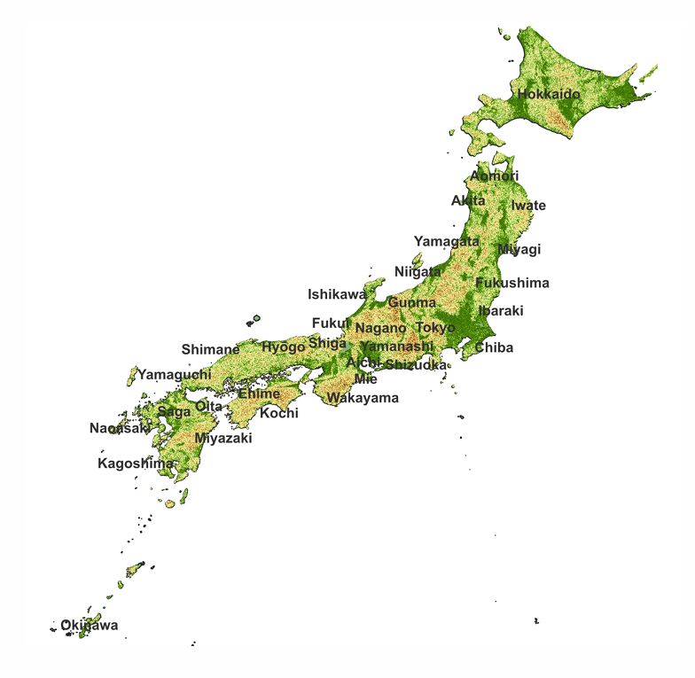
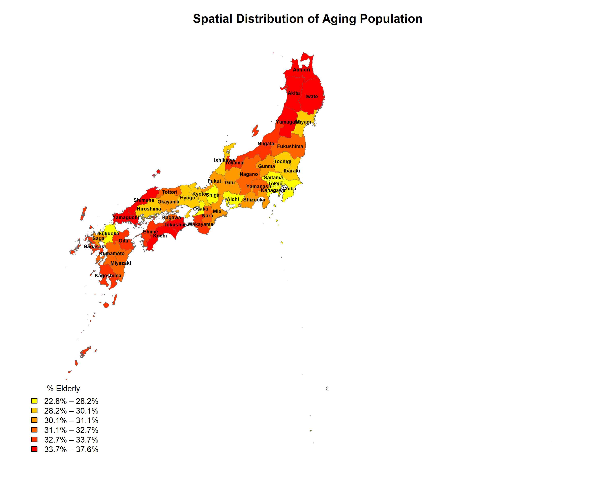
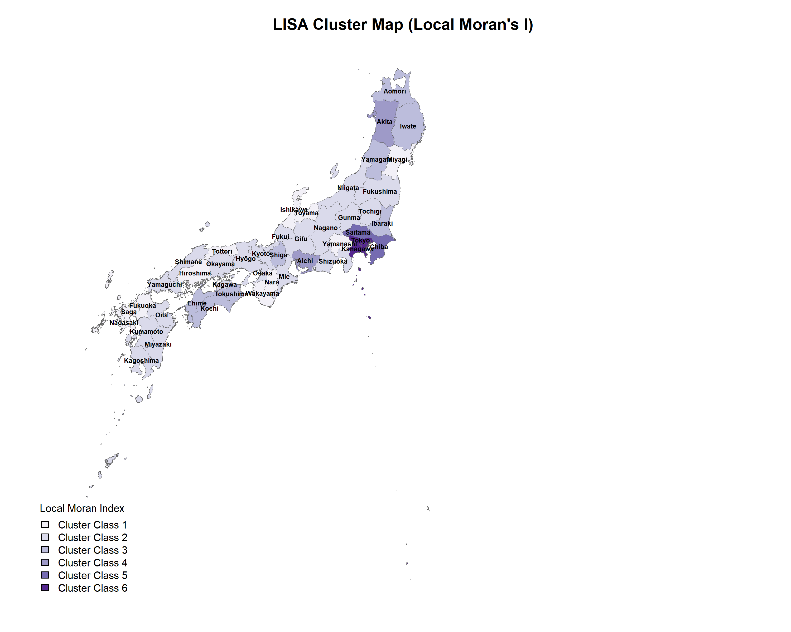
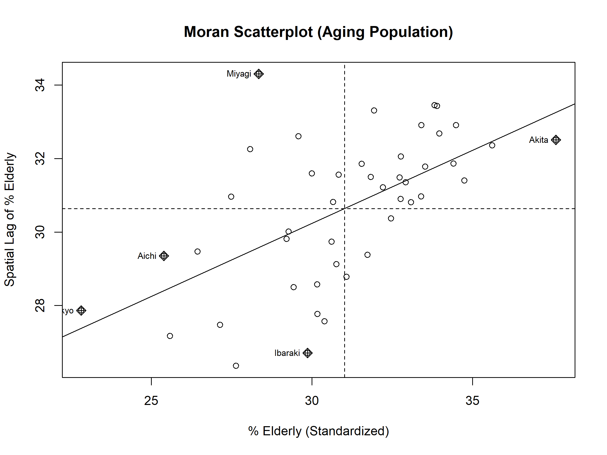

# 📍 Spatial Intelligence: Strategic Demographic Forecasting in Japan

## 📑 Business Context & Executive Summary
In global retail and supply chain management, treating administrative regions as independent data points leads to biased forecasting. This project implements **Spatial Data Science** to analyze aging population dynamics across Japan’s 47 prefectures. 

By moving beyond standard OLS regression to **Spatial Econometric Modeling (SDM)**, this study identifies regional "Silver Economy" clusters and quantifies **Spatial Spillovers**. These insights are critical for:
* **Market Optimization:** Identifying high-potential clusters for specific product lines (e.g., progressive lenses vs. trend-driven eyewear).
* **Retail Strategy:** Understanding how a store's location affects—and is affected by—the demographics of neighboring territories.
* **Risk Management:** Predictive modeling of long-term regional labor and consumer shifts.

---

## 🛠 Tech Stack
* **Statistical Modeling:** `R` (`spdep`, `spatialreg`, `ggplot2`).
* **Geospatial Engineering:** `QGIS` & `OpenTopography` (DEM processing).
* **Data Sources:** e-Stat Japan (2019) and GADM Level 1 Shapefiles.

---

## 🛰 Strategic Workflow & Methodology

### 1. Geospatial Data Engineering
A robust spatial infrastructure was built to account for Japan's unique physical geography:
* **Terrain Impact Analysis:** Integrated Digital Elevation Models (DEM) to generate **Slope** and **Hillshade** layers. This allows for the analysis of how rugged morphology restricts urban density and service accessibility.
* **Data Pipeline Optimization:** Automated nomenclature harmonization and spatial joins to ensure 100% data integrity across the archipelago.
* **Contiguity Modeling:** Structured a precise **Spatial Weight Matrix (W)**, focusing on mainland connectivity to eliminate noise from isolated island geographies.
  
  > Note: Raw DEM raster files and intermediate GIS processing outputs are not included in this repository due to file size limitations. The final processed visualization is provided below.

    <h3 align="center">Terrain Morphology of Japan</h3>

  

### 2. Exploratory Spatial Data Analysis (ESDA)
* **Cluster Identification:** Confirmed significant regional clustering with a **Moran’s I of 0.398** ($p < 0.001$).
* **Hotspot Mapping (LISA):** Pinpointed statistically significant **High-High clusters** of aging and **Low-Low "Youth Hubs"** (e.g., the Tokyo metropolitan area).
* **Diagnostic Rigor:** Validated local dependencies using **Geary’s C** ($0.606$) to ensure the patterns weren't mere statistical anomalies.
<table align="center">
  <tr>
    <td align="center">
      <b>Spatial Distribution of Aging Population</b> 
      
    </td>
    <td align="center">
      <b>Population Density</b> 
      
    </td>
  </tr>
</table>

 

  <b>Moran Scatterplot</b>  
  

<b>Moran's I = 0.398 (p &lt; 0.001)</b> indicating significant positive spatial autocorrelation across Japanese prefectures.

### 3. Advanced Predictive Modeling

Standard linear models (OLS) were rejected in favor of architectures that internalize "Geography" as a structural variable. By treating spatial dependency not as a nuisance, but as a core data feature, the modeling pipeline achieves significantly higher predictive integrity.

* **Model Selection:** Evaluated SAR and SEM architectures against the **Spatial Durbin Model (SDM)** using **AIC** and **Likelihood Ratio (LR) tests**.
* **Best-Fit Performance:** The **SDM** ($AIC = 121.22$) was identified as the most parsimonious and informative model, outperforming baseline models by capturing spatial lag dependencies in both the dependent variable and the local covariates.

| Model Specification | AIC | Selection Status |
| :--- | :---: | :---: |
| **SDM (Spatial Durbin Model)** | **121.22** | 🏆 **Selected Model** |
| Manski / GNS | 122.11 | Candidate |
| OLS (Baseline) | 124.92 | Rejected (No Spatial Effects) |
| SEM (Spatial Error Model) | 126.72 | Rejected |
| SAR (Spatial Autoregressive) | 126.82 | Rejected |

---

* **Spillover Quantification:** Because SDM coefficients cannot be interpreted as simple linear marginal effects, a 500-run simulation ($R=500$) was implemented to decompose spatial impact profiles:
    * **Direct Effects:** Local net migration and log population density remain the primary internal drivers changing the target variable within the prefecture itself.
    * **Indirect Effects (The "Contagion" Effect):** Discovered that **Fertility Rates** and **University Density** exert strong, statistically significant spillovers on neighboring regions, proving that socioeconomic trends are highly transboundary.

| Feature / Covariate | Direct Impact | Indirect Impact (Spillover) | Total Effect | Statistical Significance |
| :--- | :---: | :---: | :---: | :---: |
| **Fertility Rate** | +1.878 | +12.799 | +14.678 | Signif. (Positive) |
| **Average Income** | +0.0001 | +0.0013 | +0.0014 | Not Signif. at 95% |
| **Log Population Density** | +0.0004 | +0.0014 | +0.0018 | Signif. (Positive) |
| **Net Migration Rate** | -6.854 | -2.697 | -9.551 | Signif. (Negative) |
| **University Density** | +0.131 | +2.853 | +2.984 | Not Signif. at 95% |
| **Hospital Availability** | +0.056 | -0.123 | -0.067 | Not Signif. at 95% |

> 💡 **Hiring Team Note (QA/Data Integrity Insight):** Statistical significance flags are programmatically assigned by checking if the simulated empirical distribution bounds ($2.5\%$ and $97.5\%$ quantiles) contain zero. If the interval crosses zero, the effect is flagged as *Not Significant*, mitigating false-positive risk across our automated geospatial estimation pipelines.

---

## 📈 Potential Business Impact
* **Unbiased Decision Making:** The final model captured all spatial dependencies, with residuals showing **zero remaining autocorrelation** ($p = 0.638$).
* **Regional vs. Local Strategy:** Proved that demographic trends are "contagious." Strategic interventions (marketing or retail) must be designed at the **Cluster Level** rather than the individual prefecture level.
* **Targeted Growth:** Identified that dense urban areas maintain younger populations, while high-aging targets are localized in regions with specific morphological constraints.

---

